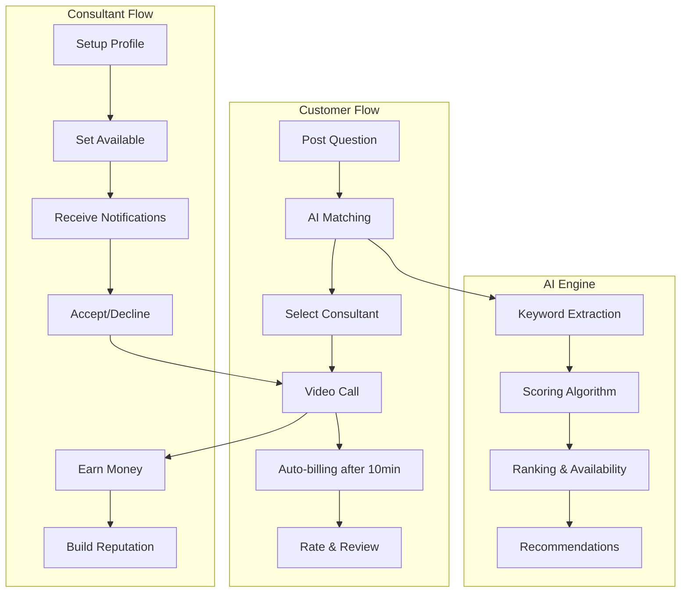

# Consultant Connect - AI-Powered Expert Platform

## Vision
AI-driven platform connecting customers with consultants for instant video consultations with smart 10-minute auto-billing.

## Core Value Proposition
- **Instant Connection**: Question → AI match → Video call in <2 minutes
- **Smart Billing**: Free first 10 minutes, auto-charge after that
- **Quality Guaranteed**: AI-driven matching ensures relevant expertise
- **Zero Friction**: No scheduling, no complex booking flows

## Technology Stack

<<<<<<< HEAD
* **Backend:** Python (FastAPI)
* **Frontend:** React (Vite)
* **Database:** PostgreSQL
* **Cloud Provider:** AWS (Targeting services like Fargate/Lambda, RDS, S3)
* **Repository:** GitHub (Public)

## Architecture
=======
- **Backend:** FastAPI + PostgreSQL + JWT Authentication
- **Frontend:** React + TypeScript + Vite  
- **Video:** WebRTC (future: Zoom API integration)
- **Payments:** Stripe (Connect for consultant payouts)
- **AI Matching:** Keyword extraction + scoring algorithm
- **Deployment:** AWS (Fargate/Lambda + RDS + S3)

## Architecture Overview

>>>>>>> b085029 (Initial implementation of business-ready minimal application)


<<<<<<< HEAD
## Getting Started

The project uses **Docker Compose** for a hassle-free local setup.

```bash
git clone <repo-url>
cd consultant-connect
docker compose up --build
```

This starts a FastAPI backend, a PostgreSQL database and a Vite dev server. The frontend is available at `http://localhost:3000` and the backend at `http://localhost:8000`. Environment variables can be configured in `.env.example`.

The frontend reads `VITE_API_URL` to know the backend URL (defaults to `/api`).
=======
=======
## MVP Features (4-6 weeks)

### Week 1: Backend Foundation
- [x] Database models (User, Question, Session, Rating)
- [ ] JWT authentication system
- [ ] API structure and routing
- [ ] Database migrations
>>>>>>> b085029 (Initial implementation of business-ready minimal application)

### Week 2: Core Business Logic  
- [ ] Question posting and matching APIs
- [ ] Real-time consultant availability
- [ ] Basic AI matching algorithm
- [ ] Session management endpoints

<<<<<<< HEAD
* User Registration/Login (Seeker, Consultant)
* Basic Consultant Profile Management (Create/Edit/View)
* Seeker Discovery (List/Search Consultants, View Profiles)

Additional planning documents can be found in the [docs](docs/) directory, including user personas, customer journey maps and the detailed roadmap.
Detailed deployment instructions for Hetzner are in [docs/DEPLOYMENT_GUIDE.md](docs/DEPLOYMENT_GUIDE.md).
=======
### Week 3: Payment & Video
- [ ] Stripe integration (customers + Connect)
- [ ] WebRTC video call implementation
- [ ] 10-minute timer and auto-billing
- [ ] Session recording capability

### Week 4: Frontend Application
- [ ] React app with authentication
- [ ] Question posting interface
- [ ] Consultant discovery and profiles
- [ ] Video call interface with timer

### Week 5-6: Polish & Launch
- [ ] Rating and review system
- [ ] Performance optimization
- [ ] Error handling and edge cases
- [ ] Basic admin tools

## Getting Started

### Prerequisites
- Python 3.9+
- Node.js 18+
- PostgreSQL 13+

### Backend Setup
```bash
cd backend
python -m venv venv
source venv/bin/activate  # On Windows: venv\Scripts\activate
pip install -r requirements.txt

# Setup database
createdb consultant_connect
alembic upgrade head

# Start development server
uvicorn app.main:app --reload
```

### Frontend Setup
```bash
cd frontend
npm install
npm run dev
```

### Environment Variables
Create `.env` in backend directory:
```
POSTGRES_SERVER=localhost
POSTGRES_USER=postgres
POSTGRES_PASSWORD=password
POSTGRES_DB=consultant_connect
SECRET_KEY=your-secret-key-here
```

## Success Metrics

- **Customer Experience:** Question to call connection < 2 minutes
- **Consultant Utilization:** 80%+ of available time booked
- **Platform Reliability:** 95%+ session completion rate  
- **Revenue Goal:** 15% commission on all billable sessions

## Business Model

- **Commission:** 15% of consultant earnings
- **Freemium Features:** Session recordings, analytics, priority support
- **Premium Consultant Tools:** Featured placement, advanced scheduling

## Roadmap Beyond MVP

- Mobile applications (React Native)
- Advanced AI matching with ML
- Multi-language support
- Calendar integrations (Google, Outlook)
- Team consultation features
- API for third-party integrations

---

*Building the future of expert consultation, one AI match at a time.*
>>>>>>> b085029 (Initial implementation of business-ready minimal application)
